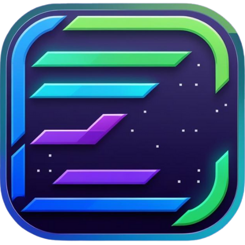

<p align="center">
  
</p>

# 🚀 AI Prompt Dashboard

A modern web application for managing and organizing your AI prompts, with tagging, search, and cloud synchronization.


## ✨ Features

- **Organize AI Prompts**: Store, edit, and categorize prompts for various AI models
- **Custom Tagging**: Organize prompts with custom tags for easy retrieval
- **Powerful Search**: Find the perfect prompt with full-text search and tag filtering
- **Dual Storage**:
  - Store prompts locally in your browser
  - Cloud sync with Supabase for cross-device access
  - Optional hybrid mode to sync between both
- **AI Assistant**: Generate new prompt ideas with AI help
- **Modern UI**: Clean, responsive interface built with Shadcn/UI and Tailwind

## 🖥️ Screenshots

*Coming soon*

## 🛠️ Installation

### Local Development

```bash
# Clone the repository
git clone https://github.com/yourusername/prompt-dashboard.git

# Navigate to the project directory
cd prompt-dashboard

# Install dependencies (choose one)
npm install
# or
bun install
# or
yarn install

# Start the development server
npm run dev
# or
bun run dev
# or
yarn dev
```

### Deployment

For deploying to Cloudflare Pages or other platforms, see the [DEPLOYMENT.md](DEPLOYMENT.md) guide.

## 🔧 Configuration

### Local Storage

By default, the application uses browser localStorage - no configuration needed!

### Supabase Configuration

To use cloud storage features:

1. Create a Supabase account and project at [supabase.com](https://supabase.com)
2. Configure your Supabase credentials:

   - Open the Prompt Dashboard
   - Go to Settings (gear icon)
   - Select "Supabase" or "Both" as your storage option
   - Enter your Supabase Project URL and API Key
     - Find these in your Supabase dashboard under Project Settings → API
   - Click "Test Connection" to verify your credentials
3. Create the required database table:

   - After connecting, you'll need to set up the prompts table
   - Click the "Open Supabase SQL Editor" button in the settings
   - Copy and paste the following SQL:

   ```sql
   CREATE TABLE IF NOT EXISTS prompts (
     id UUID PRIMARY KEY DEFAULT uuid_generate_v4(),
     content TEXT NOT NULL,
     tags TEXT[] DEFAULT '{}',
     createdat TIMESTAMP WITH TIME ZONE DEFAULT CURRENT_TIMESTAMP,
     title TEXT,
     category TEXT DEFAULT 'task',
     description TEXT DEFAULT '',
     user_id TEXT NOT NULL,
     ispublic BOOLEAN DEFAULT false,
     likes INTEGER DEFAULT 0,
     views INTEGER DEFAULT 0,
     comments INTEGER DEFAULT 0
   );
   ```
4. Run the SQL to create the table
5. Return to the Prompt Dashboard and click "Test Connection" again to verify the table setup
6. Save your settings

The application will now use your Supabase instance for cloud storage!

#### Synchronization Details

When using the "Both" storage option:

- New prompts are saved to both local storage and Supabase
- When you open the application, it will:
  1. Load local prompts first
  2. Fetch prompts from Supabase
  3. Merge them, preferring Supabase versions for duplicate IDs
  4. Sync any unique local prompts to Supabase
  5. Save any unique Supabase prompts to local storage

This bidirectional sync ensures your prompts are available across devices and you always have a local backup.

> **Note:** Cloud sync requires opening the application with the same Supabase configuration on all devices. Your storage preference is saved in your browser's localStorage.

## 📖 Usage

1. Launch the application
2. Choose your storage preference (local, Supabase, or both)
3. Add prompts with the "+" button
4. Assign tags to organize your prompts
5. Use the search box and tag filters to find prompts
6. Select a prompt to copy it or edit its details

## 🧩 Tech Stack

- React 18.3 with TypeScript
- Vite for fast builds
- Tailwind CSS
- Shadcn/UI components
- TanStack Query
- React Hook Form with Zod
- Supabase for auth and storage
- Cloudflare Pages for deployment

## 📋 Roadmap

- [ ] Prompt version history
- [ ] AI prompt templates
- [ ] Shared prompt libraries
- [ ] Additional storage backends
- [ ] Advanced tagging with hierarchies

## 🤝 Contributing

Contributions are welcome! See the [CONTRIBUTING.md](CONTRIBUTING.md) file for details.

## 📜 License

This project is licensed under the MIT License - see the [LICENSE](LICENSE) file for details.

## 🙏 Acknowledgments

- [Shadcn/UI](https://ui.shadcn.com/) for the beautiful UI components
- [Tailwind CSS](https://tailwindcss.com/) for styling
- [Supabase](https://supabase.com/) for authentication and cloud storage

---

Made with ❤️ by [Pink Pixel](https://pinkpixel.dev)
